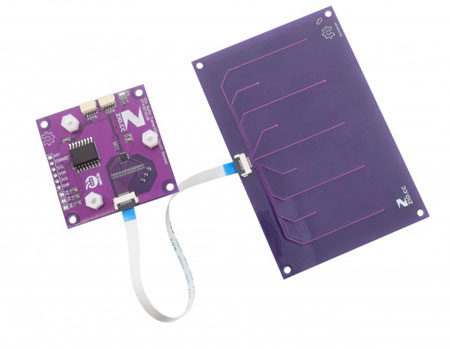

## Zio Qwiic Capacitive Touch Sensor AT42QT2120 V2.0

This product can be available for purchase [here](https://www.smart-prototyping.com/Zio-Qwiic-Capacitive-Touch-Sensor-Module-AT42QT2120).

### Description

This is a Qwiic version of the touch sensor based on the AT42QT2120 sensor. It can sense up to 12 keys, dependent on mode. Three of the keys can be used as sense channels for a slider or wheel, and 9 standard touch keys.

The Touch Wheel in this sensor is unique and different from other similar looking wheel sensors in terms of its added functionality. It can also be applied to create applications that need volume adjustment, light brightness, or wheel lights.

We’ve prepared the touch wheel and the keyboard for you and also included the source PCB file on our GitHub page for easy customization.

### Specifications

* IC :  AT42QT2120 & PCF8574T
* Default I2C Address: 0x1c & 0x23
* Operation Voltage: 3.3V
* Main board 
    - Dimension: 46.7 x 46.7mm
    - Weight: 7.6g
* Wheel touchpad: 
    - 0-255 ADC output, 
    - Dimension: 33.8mm diameter
    - Weight: 4.3g
* Keyboard, 
    - 9 keys, from key 4 to key 11
    - Dimension: 66.9 x 99.8mm 
    - Weight: 22.3g

